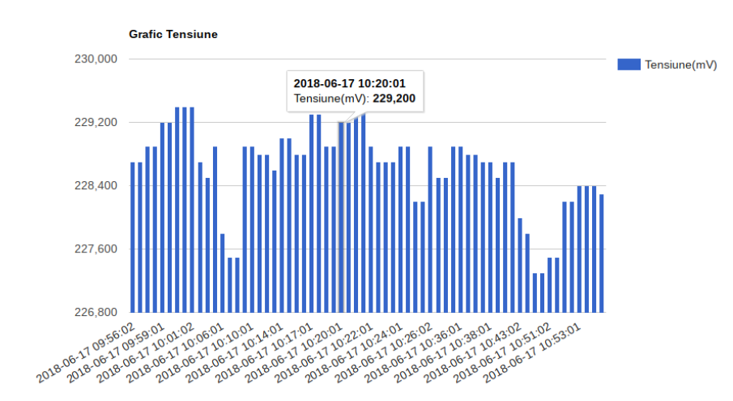
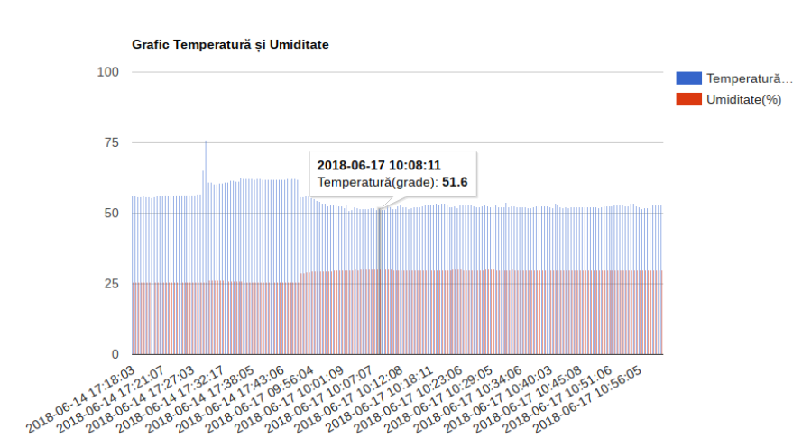
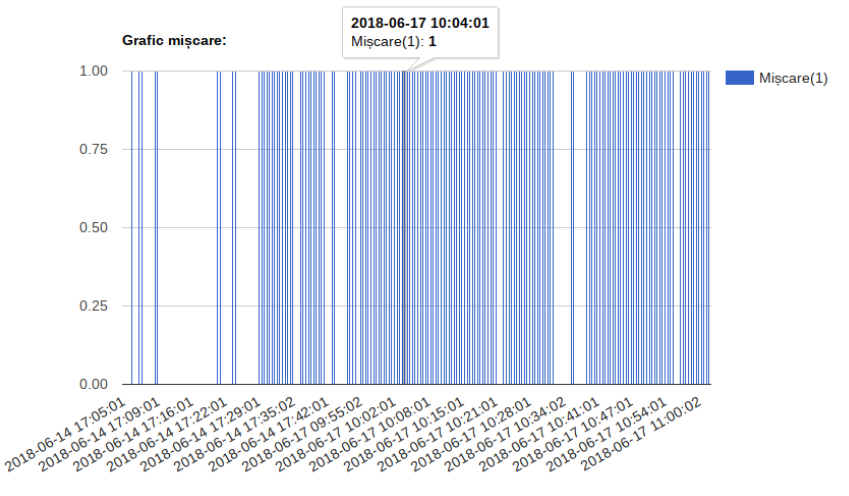

IOT app - data system colection using Raspberry PI
=========

Hardware technologies
---------------

- RASBERRY PI V3
- NEMO96HD - comunication module for tension collection
- PIR - movement sensor
- DHT22 - temperature and humidity sensor

## Description

Implementing a "Data Acquisition System" on the microcomputer Raspberry PI with two sensors and a communication module.

Development of a system designed as an IoT solution (“Internet of Things ”) for monitoring equipment in a room. To make this has implemented a web service with the role of monitoring parameters collect: voltage, temperature, humidity and movement.

Solving the problems encountered:
- careful choice of sensors
- connection corrections
- fixes so as not to overload the web server

Architecture
-----

Graphs resulted
-----

